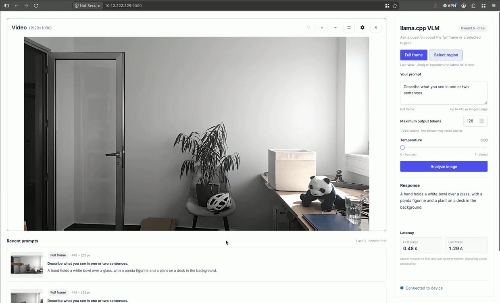
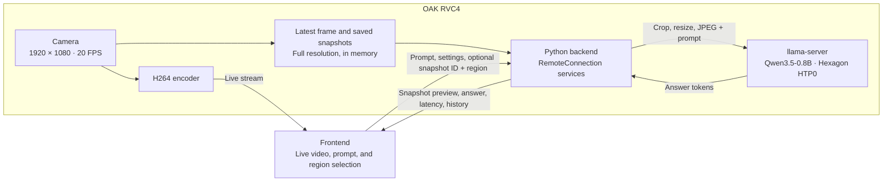

# llama.cpp VLM

This application demonstrates on-device visual question answering with **llama.cpp**
and **Qwen3.5-0.8B**, using a live camera stream and an interactive Luxonis frontend.

The UI provides controls for:

- Asking questions about the full camera frame or a selected region
- Adjusting the output-token limit and temperature
- Viewing streamed answers, first/last-token latency, and the three latest requests

> **Note:** RVC4 standalone mode only. Requires Luxonis OS 1.40 or newer.

## Demo



## Architecture



Region selection uses a frozen preview of a saved camera frame. The frontend
sends rectangle coordinates and the snapshot ID; the backend crops the original
1080p frame before resizing it.

The model and vision projector request the Hexagon backend. Unsupported operations
may still execute on CPU; llama-server logs the actual placement.

______________________________________________________________________

## Features

- **Full-frame and region prompts**

  - **Full frame** analyzes the latest camera frame.
  - **Select region** captures a snapshot; drag a rectangle over the area to analyze.
  - **New snapshot** refreshes the selection image. Snapshots expire after five minutes.
  - Inputs preserve their aspect ratio and are downscaled to a maximum edge of
    448 pixels by default. Small crops are not enlarged by the app; llama.cpp
    handles the model's internal patch alignment and padding.

- **Generation controls**

  - Maximum output tokens: **1–256**, default **128**. Answers can finish sooner.
  - Temperature: **0–1**, default **0**. Lower values favor less varied answers.
  - Changes apply to the next request without reloading the model. Thinking is disabled.

- **Streamed answers and latency**

  - Answers appear incrementally, with one request processed at a time.
  - **First token** and **Last token** measure from the model HTTP request to the
    first and last answer-text events. During generation, the latter shows the
    latest token time.
  - Timings include vision encoding and prompt evaluation, and exclude camera
    capture, app-side crop/JPEG preparation, and frontend transport.

- **Recent prompts**

  - The latest three requests show the submitted image, mode, prompt, and answer,
    ordered newest first.
  - History stays in container memory and clears on app restart.
  - Each inference is independent; previous answers are not sent to the model.

- **Self-contained model assets**

  - Uses Qwen3.5-0.8B Q4_0 and its F16 vision projector, licensed under Apache-2.0.
  - Pinned weights are downloaded and SHA-256 verified during the container build.
  - Files live at `/opt/qwen-models` inside the app image. No external model cache,
    manually copied weights, or runtime downloads are required.
  - Model source: [unsloth/Qwen3.5-0.8B-GGUF](https://huggingface.co/unsloth/Qwen3.5-0.8B-GGUF/tree/6ab461498e2023f6e3c1baea90a8f0fe38ab64d0).
    Revision and checksums are defined in [models.py](backend/src/models.py).

- **Configuration (YAML constants)**

  - [config.yaml](backend/src/constants/config.yaml) defines image sizing,
    generation defaults, and llama-server settings such as context size, threads,
    flash attention, fitting, context shifting, and vision-token limits.
  - Edit the file and redeploy the app to load the updated settings. Quote `"on"`
    and `"off"` when configuring flash attention in YAML.

______________________________________________________________________

## Usage

Running this example requires a **Luxonis RVC4 device** reachable from your computer.
Refer to the [documentation](https://docs.luxonis.com/software-v3/) to set up your
device if you haven't already.

The app uses `llamacpp` oakapp base image variant.
The device OS must expose `/opt/luxonis/npu-runtime` and the FastRPC
devices required by the base image.

The first container build requires internet access and downloads approximately
712 MB of model data, in addition to application dependencies.

______________________________________________________________________

## Standalone Mode (RVC4)

First install `oakctl` using the [installation instructions](https://docs.luxonis.com/software-v3/oak-apps/oakctl).

From this example's directory, run:

```bash
oakctl connect <DEVICE_IP>
oakctl app run .
```

Once the app is built and running, open `https://<DEVICE_IP>:9000/` in your browser.
The exact frontend URL is shown in the terminal output.

Wait for the model to load, enter a prompt, choose **Full frame** or **Select region**,
and select **Analyze image**.

### Remote access

1. You can upload oakapp to Luxonis Hub via oakctl
2. And then you can just remotely open App UI via App detail
