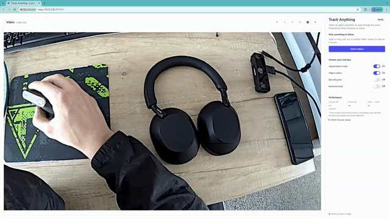
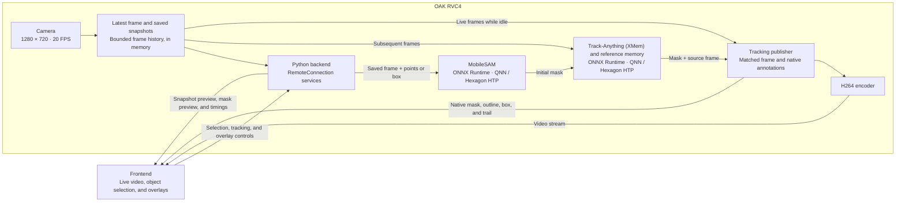

# Track Anything with ONNX Runtime

This application demonstrates on-device object segmentation and tracking with
**ONNX Runtime**, [**MobileSAM**](https://aihub.qualcomm.com/models/mobilesam), and
[**Track-Anything (XMem)**](https://aihub.qualcomm.com/models/track_anything), using
a live camera stream and an interactive Luxonis frontend.

The UI provides controls for:

- Selecting an object with Include/Exclude points or a bounding box
- Following its segmentation mask, outline, bounding box, and movement trail
- Viewing tracking rate, processing latency, and model-stage timings

> **Note:** RVC4 standalone mode only. Requires Luxonis OS 1.40 or newer.

## Demo



## Architecture



Object selection uses a frozen preview of a saved camera frame.
[MobileSAM](https://aihub.qualcomm.com/models/mobilesam) creates an initial mask
from the selected points or box; [Track-Anything's XMem tracker](https://aihub.qualcomm.com/models/track_anything)
then propagates that mask through subsequent frames. During tracking, the publisher
pairs each mask with the exact camera frame used for inference.

Model inference and memory matching run through ONNX Runtime's QNN execution
provider on the Hexagon HTP. Unsupported execution fails visibly; there is no
CPU fallback or execution-provider switch.

______________________________________________________________________

## Features

- **Point and box selection**

  - **Select object** captures a snapshot. Add an **Include** point on the target,
    refine with **Exclude** points, or draw a **Box**.
  - Up to **eight prompt slots** are supported. Each click uses one slot; a box
    replaces previous prompts and uses two, leaving six for refining clicks.
  - First use of a prompt count compiles its decoder for QNN. Only the active
    decoder stays in memory; switching back loads its compiled cache from inside
    the container. Replacing the container can require compilation again.
  - **Start tracking** confirms the mask. Snapshots expire after **20 seconds**;
    a toast explains the expiry and **Capture updated frame** starts a new selection.
  - Keep the target reasonably still during selection. The tracker catches up
    through recent frames before returning to live video.

- **Continuous single-object tracking**

  - Follow an object without choosing a predefined detector class.
  - The [XMem tracker](https://aihub.qualcomm.com/models/track_anything) retains the
    initial reference frame and four recent memory frames.
  - **Reselect object** replaces the selection; **Clear target** returns to the
    camera view. Tracking state stays in memory and clears on app restart.
  - Long occlusions, fast motion, and similar-looking objects can cause drift.
    Tracking does not guarantee re-identification after the target leaves the scene.

- **Tracking rate and latency**

  - View tracking updates per second, processing time, and individual model-stage timings.
  - **Frame → result** measures from receipt of a camera frame to its tracking result.
    Browser transport, decoding, and display latency are additional.

______________________________________________________________________

## Usage

Running this example requires a **Luxonis RVC4 device** reachable from your computer.
Refer to the [documentation](https://docs.luxonis.com/software-v3/) to set up your
device if you haven't already.

The app uses the `onnxruntime` oakapp base image variant.
The device OS must expose `/opt/luxonis/npu-runtime` and the FastRPC
devices required by the base image.

The first container build requires internet access and downloads approximately
294 MiB of model archives, in addition to application dependencies.

Note that initial app start is expected to take more time because models need to be optimized
for QNN backend usage. After that though consecutive inferences are fully accelerated.

______________________________________________________________________

## Standalone Mode (RVC4)

First install `oakctl` using the [installation instructions](https://docs.luxonis.com/software-v3/oak-apps/oakctl).

From this example's directory, run:

```bash
oakctl connect <DEVICE_IP>
oakctl app run .
```

Once the app is built and running, open `https://<DEVICE_IP>:9000/` in your browser.
The exact frontend URL is shown in the terminal output.

Wait for the models to load, choose **Select object**, click the target or draw a
**Box**, and select **Start tracking**. If initialization fails, **Retry loading models**
retries verification and loading; missing or damaged bundled files require rebuilding
and redeploying the app.

### Remote access

1. You can upload oakapp to Luxonis Hub via oakctl
2. And then you can just remotely open App UI via App detail
