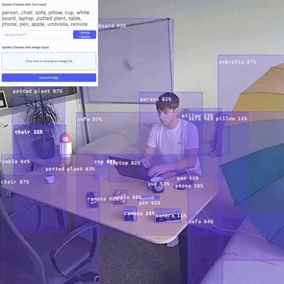

# Open Vocabulary Object Detection

This example demonstrates an advanced use of a custom frontend. On the DepthAI backend, it runs either **YOLOE** (default) or **YOLO-World** on-device, with configurable class labels and confidence threshold — both controllable via the frontend.
The frontend, built using the `@luxonis/depthai-viewer-common` package, displays a real-time video stream with detections.

> **Note:** This example works only on RVC4 in standalone mode and requires Luxonis OS 1.40 or newer.

## Demo



## Usage

Running this example requires a **Luxonis device** connected to your computer. Refer to the [documentation](https://docs.luxonis.com/software-v3/) to setup your device if you haven't done it already.

Here is a list of all available parameters:

```
  -fps FPS_LIMIT, --fps_limit FPS_LIMIT
                        FPS limit for the model runtime. (default: None)
  -media MEDIA_PATH, --media_path MEDIA_PATH
                        Path to the media file you aim to run the model on. If not set, the model will run on the camera input. (default: None)
  -m {yolo-world,yoloe}, --model {yolo-world,yoloe}
                        Name of the model to use: yolo-world or yoloe (default: yoloe)
  --semantic_seg        Display output as semantic segmentation otherwise use instance segmentation (only applicable for YOLOE). (default: False)
```

Notes:

- The backend CLI currently supports `--fps_limit`, `--media_path`, `--model`, and `--semantic_seg`.
- Frontend serving is handled by the packaged oakapp container stack, so there are no active `--ip` or `--port` CLI options here.
- Model precision is currently controlled by the backend configuration files, not by a CLI flag.

### Model Options

This example supports two YOLO models:

- **YOLOE** (default): Supports both text prompts and image prompts (visual prompts). The model outputs 160 classes in total: indices 0–79 correspond to text prompts, and indices 80–159 correspond to image prompts. When only one prompt type is provided, dummy inputs are sent for the other and ignored by the model.
- **YOLO-World**: Open-vocabulary detection with text prompts and optional image prompting (CLIP visual encoder).

Notes:

- Backend function `extract_image_prompt_embeddings(image, max_num_classes=80, model_name, mask_prompt=None)` accepts an optional `mask_prompt` of shape `(80,80)` or `(1,1,80,80)` for `yoloe`. When `None`, a default central mask is used.

## Standalone Mode (RVC4 only)

Running the example in the standalone mode, app runs entirely on the device.
To run the example in this mode, first install the `oakctl` tool using the installation instructions [here](https://docs.luxonis.com/software-v3/oak-apps/oakctl).

The app can then be run with:

```bash
oakctl connect <DEVICE_IP>
oakctl app run .
```

Once the app is built and running you can access the DepthAI Viewer locally by opening `https://<OAK4_IP>:9000/` in your browser (the exact URL will be shown in the terminal output).

This will run the example with default argument values (YOLOE model). If you want to change these values you need to edit the `backend-run.sh` file to pass the arguments to the backend. Example:

```bash
python3.12 /app/backend/src/main.py --model yoloe --fps_limit 10 --semantic_seg
```

### Remote access

1. You can upload oakapp to Luxonis Hub via oakctl
2. And then you can just remotely open App UI via App detail
