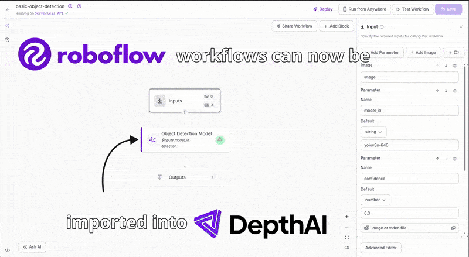

# Roboflow Workflow

This application integrates a DepthAI device with `Roboflow Workflow` through `inference` package. Camera frames are handed to Roboflow's `InferencePipeline` through a custom `VideoFrameProducer`, processed by the workflow's models directly on the device, and the results are sent to the DepthAI visualizer for real-time viewing. You can change the parameters of the inference pipeline through the interactive UI.

## Demo



## Usage

Before running this example, you’ll first need to create your own [Roboflow Workflow](https://roboflow.com/workflows/build) in the Roboflow web app ([documentation](https://docs.roboflow.com/workflows/create-a-workflow)).

Once your workflow is ready, populate the initial Roboflow settings in [config.yaml](./backend/src/config/yaml_configs/config.yaml).

To retrieve the required values:

- Open your workflow in Roboflow and click `Deploy`
- Choose `Video` -> `Live Video`
- Select `Run locally on my server or computer`
- In the provided code snippet, you’ll find:
  - `workspace_name`
  - `workflow_id`
- To get your `api_key`, go to `Settings` -> `API Keys` and copy your `Private API Key`
- The `workflow_parameters` correspond to the inputs defined on the `Inputs` node in your workflow.

At runtime, the custom frontend currently supports updating only:

- `api_key`
- `workspace_name`
- `workflow_id`
- `workflow_parameters`

Pipeline settings such as `device`, `output_size`, and `fps` still come from [config.yaml](./backend/src/config/yaml_configs/config.yaml) at startup.

> **Note:** You can update the supported Roboflow values later while the app is running using the custom front-end form. But you still need to start the app with some valid initial values.

### Runtime workflow controls

The custom frontend supports the following while the app is running:

- Switch to another workflow by entering its workspace and workflow ID, then submitting the form. The app rebuilds the visualizer topics when the new workflow has different outputs; parameters from the previous workflow are discarded and the new workflow starts with its defaults.
- Click the ↻ button to re-fetch the active workflow definition after editing it in the Roboflow builder. This updates the parameter form and restarts inference without redeploying the app.
- View inference pipeline errors directly in the form. Correct the workflow or parameters, then use ↻ or submit updated values to retry.

## Workflow Visualization Rules & Limitations

Our system applies a few naming-based rules to determine how workflow outputs are visualized. Keep the following guidelines in mind:

#### 1. Outputs containing `predictions`

Outputs whose names include the substring `predictions` are treated as **DepthAI detection messages**. Only the bounding box information is processed; any additional fields in the Roboflow Detection message will be ignored.

If your workflow produces a `Roboflow Detection` message, ensure its output name includes `predictions` so it can be detected and parsed correctly.

#### 2. Outputs containing `visualization`

Outputs whose names include the substring `visualization` are interpreted as DepthAI ImgFrame messages.

If your workflow produces `Roboflow WorkflowImageData`, include `visualization` in the output name so we can display it properly.

#### 3. Outputs that do not match any rule

Outputs whose names do not contain either predictions or visualization are **ignored by the visualizer**.

#### Advanced Visualization Options

For richer or customized visual outputs, consider:

- Adding `Visualization` blocks directly inside your workflow and ensuring the resulting output name contains `visualization`.
- Extending the [AnnotationNode](./backend/src/core/annotation_node.py) with custom logic tailored to your data type.

## Standalone Mode (RVC4 only)

Running the example in the standalone mode, app runs entirely on the device.
To run the example in this mode, first install the `oakctl` tool using the installation instructions [here](https://docs.luxonis.com/software-v3/oak-apps/oakctl).

The app can then be run with:

```bash
oakctl connect <DEVICE_IP>
oakctl app run .
```

Once the app is built and running you can access the DepthAI Viewer locally by opening `https://<OAK4_IP>:9000/` in your browser (the exact URL will be shown in the terminal output).

> **Note:** Requires Luxonis OS 1.40 or newer. The backend sets `USE_INFERENCE_MODELS=False` so models are executed through the classic ONNX Runtime path of the `inference` package, which is considerably faster than the default torch-based backend on the device's ARM CPU.

## NPU acceleration

On OAK4, workflow ONNX models run on the Hexagon DSP through the  `onnx_qnn_session` helper. The session router fixes dynamic batch dimensions, runs fp32 weights as fp16 on the HTP, and reuses the cached compiled graph. Unsupported models fall back to the CPU unless `STRICT=1` is set.

The default is `EP=dsp`; use `EP=cpu` only to disable DSP acceleration for debugging.
