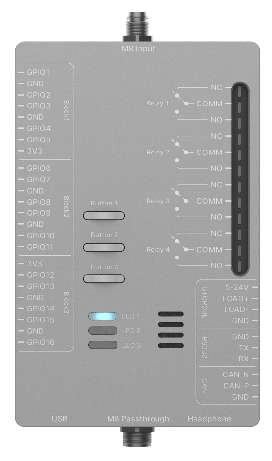

# M8 Controller Box (PR1)

The **M8 Controller Box (PR1)** is a USB-connected expansion module designed for integrating CAN devices, GPIO, relays, and peripheral interfaces into OAK-based systems.

This document serves as the **primary usage reference** for the M8 Controller Box within `oak-examples`.

> **Note:** The examples in this directory are intended to run on **OAK4 in standalone mode**. The M8 Controller Box connects directly to the OAK4 device, so these examples are not supported in host-driven peripheral mode.


## Key Features

### CAN Interface

* Supports **CAN 2.0A and 2.0B**
* Baud rates up to **1 Mbps**
* Native **Linux SocketCAN** interface

> For more information look at [can-example](./can-example/)

### USB Audio

* Integrated **buzzer / 3.5mm audio output**
* Available via internal USB connection

> For more information look at the [simple-example](./simple-example/)

### USB Expansion

* **2× USB-A ports**
* USB 2.0 speeds
* Up to **500mA current limit (shared)**


### Serial Interface

* **1× RS232 interface**

> See [simple-example](./simple-example/) and modify `main.py` with [library example](https://github.com/luxonis/rp2040_u2if/blob/main/examples/ControllerBox/example_controller_box_serial.py).

### Isolated Strobe Driver

* Supports **5–24V strobe lights**
* Electrically isolated output

> For more information look at the [strobe-relay example](./strobe-relay-example/)

### GPIO

* **16× GPIO pins**
* 3.3V logic level
* Reverse voltage protection and ESD protection
* Configurable as input or output

**Electrical limits:**

* Total combined current must not exceed **50mA**

> For more information look at the [simple-example](./simple-example/)

### Power Relays

* **4× SPDT latching relays**
* Up to **16A current**
* Maximum **400VAC switching voltage**

> For relay control, see the [strobe-relay example](./strobe-relay-example/).

### User Interface

* **3× physical buttons**
* **3× status LEDs**

> For more example look at the [simple-example](./simple-example/)

## Pinout

Device-level pinout is shown below:




## Example Applications

The repository includes reference applications demonstrating typical usage.

### [simple-example](./simple-example/)

* Blinks LED 1
* Button 2 toggles LED 2


### [depthai-example](./depthai-example/)

* Based on Luxonis hand pose detection
* Turns on LED 1 when a hand is detected


### [can-example](./can-example/)

* Monitors button 1
* Sends CAN frame on press
* Uses Linux SocketCAN (`python-can`)

### [strobe-relay-example](./strobe-relay-example/)

* Detects barcodes using `pyzbar`
* On barcode detection it switches relay

## Running The Examples

All examples in this directory should be run as OAK apps on the OAK4 device.

1. Install `oakctl` by following the instructions [here](https://docs.luxonis.com/software-v3/oak-apps/oakctl).
2. Change into the example directory you want to run.
3. Connect to the device and start the app:

```bash
oakctl connect <DEVICE_IP>
oakctl app run .
```

If you have a locally connected device, `oakctl app run .` may be enough. Use `oakctl connect <DEVICE_IP>` when targeting a device over the network or when multiple devices are available.

## Notes

* GPIO and peripheral control is exposed via the **u2if (USB-to-interfaces) protocol**
* Example applications demonstrate recommended interaction patterns
* Library repository: [rp2040_u2if](https://github.com/luxonis/rp2040_u2if) - Note, library must be used within OAK App, to run on the device - running these on Host will result in following error:
```
File "rp2040_u2if\examples\example_simple.py", line 5, in <module>

    rp2040.open()

    ~~~~~~~~~~~^^

  File ".venv\Lib\site-packages\luxonis_u2if\rp2040_u2if.py", line 154, in open

    self._hid.open(self._vid, self._pid, self._serial)

    ~~~~~~~~~~~~~~^^^^^^^^^^^^^^^^^^^^^^^^^^^^^^^^^^^^

  File "hid.pyx", line 143, in hid.device.open

OSError: open failed

Process finished with exit code 1
```


## Support

For integration support or early access features, contact support@luxonis.com
