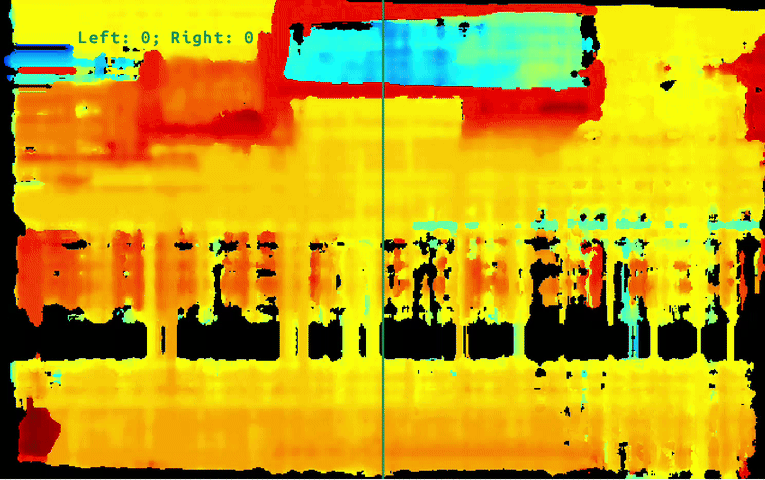

# Depth people counting

This example demonstrates how to count people crossing a virtual line using depth frames captured along a passageway.
By relying solely on depth data (rather than RGB images), this approach preserves privacy while still providing accurate counts — making it well-suited for applications where strict privacy is required.

This demo uses several hard-coded values that are tuned for a specific [DepthAI recording](./resources).
If you want to record your own recording using the [DepthAI record tool](../gen2-record-replay/).
However, beware to adapt the hard-coded values to your own setup, as they are highly dependent on the OAK camera type, installation, its field of view (FOV), and the physical structure of the passageway.

## Demo

[](media/depth-people-counting.gif)

## Usage

Running this example requires a **Luxonis device** connected to your computer. Refer to the [documentation](https://docs.luxonis.com/software-v3/) to setup your device if you haven't done it already.

You can run the example your computer as host ([`PERIPHERAL` mode](#peripheral-mode)).

Here is a list of all available parameters:

```
-d DEVICE, --device DEVICE
                        Optional name, DeviceID or IP of the camera to connect to. (default: None)
-media MEDIA_PATH, --media_path MEDIA_PATH
                        Path to the directory containing the media files used by the application. (default: live camera input).
-a AXIS, --axis AXIS
                        Axis for cumulative counting (either x or y). (default: x)
-pos AXIS_POSITION, --roi_position ROI_POSITION
                        Position of the axis (if 0.5, axis is placed in the middle of the frame). (default: 0.5)
```

**NOTE**: When using the `media_path` argument, the application requires the following files to be present in the specified directory:

- `calib.json`
- `left.mp4`
- `right.mp4`

For testing, you can use the sample files included in the [resources](./resources) directory.
However, keep in mind that these recordings were captured with RVC2.
While they are generally compatible with RVC4, the best results are achieved with RVC2.

## Peripheral Mode

### Installation

You need to first prepare a **Python 3.10** environment with the following packages installed:

- [DepthAI](https://pypi.org/project/depthai/),
- [DepthAI Nodes](https://pypi.org/project/depthai-nodes/).

You can simply install them by running:

```bash
pip install -r requirements.txt
```

Running in peripheral mode requires a host computer and there will be communication between device and host which could affect the overall speed of the app. Below are some examples of how to run the example.

### Examples

```bash
python3 main.py
```

This will run the example with default arguments.

```bash
python3 main.py -d <DEVICE_IP> -a y -pos 0.75
```

This will run the cumulative object counting example with the provided device ip, and the cumulative counting axis positioned along the y axis at 75% of the frame.

## Standalone Mode (RVC4 only)

Running the example in the standalone mode, app runs entirely on the device.
To run the example in this mode, first install the `oakctl` tool using the installation instructions [here](https://docs.luxonis.com/software-v3/oak-apps/oakctl).

The app can then be run with:

```bash
oakctl connect <DEVICE_IP>
oakctl app run .
```

This will run the example with default argument values. If you want to change these values you need to edit the `oakapp.toml` file (refer [here](https://docs.luxonis.com/software-v3/oak-apps/configuration/) for more information about this configuration file).
